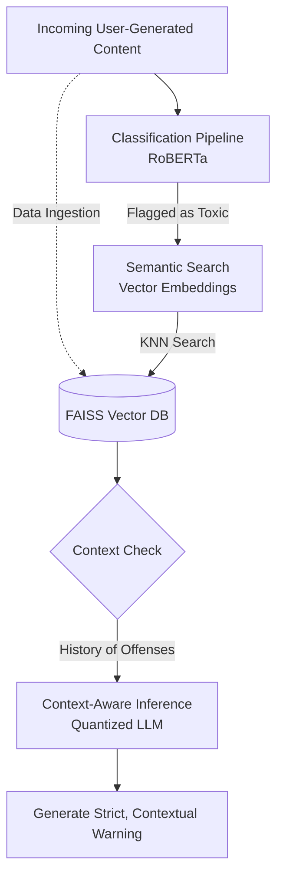

# 🛡️ EdgeGuard AI

> **Zero-Latency, On-Premise Content Moderation & RAG Pipeline**

SaaS platforms and community forums currently rely on costly, cloud-based LLM APIs (like OpenAI) for content moderation. EdgeGuard AI is a complete, local, edge-deployable AI pipeline designed to bring moderation in-house—eliminating API costs and guaranteeing data privacy.

## 📖 Table of Contents
- [The Business Case](#-the-business-case)
- [The Solution](#-the-solution)
- [Architecture Flow](#-architecture-flow)
- [Hardware Efficiency](#-hardware-efficiency)
- [Installation (Coming Soon)](#-installation)
- [Quick Start (Coming Soon)](#-quick-start)

---

## 💼 The Business Case

Current cloud-based moderation solutions create two massive liabilities for platforms operating at scale:

1. 🚨 **Data Privacy Risks (Compliance):** Sending User-Generated Content to third-party APIs violates strict data residency laws and risks Personally Identifiable Information (PII) leaks.
2. 💸 **Runaway OpEx (API Costs):** At scale, paying per-token for moderation destroys profit margins.

### ✨ The Solution
EdgeGuard AI utilizes a cascaded architecture (`DistilBERT Classifier` ➡️ `FAISS Vector DB` ➡️ `Quantized LLM`). 

**The Result:** 
* 📉 **$0.00** API moderation costs.
* 🔒 **100%** Data privacy and residency compliance. 
* ⚡ Runs efficiently on virtually any system (minimum to low hardware requirements).

---

### System Architecture

<b>Click here to read the detailed step-by-step breakdown</b>

 
<ul>
<li><b>Classification Pipeline:</b> Incoming User-Generated Content is tokenized and processed by a fine-tuned binary classifier (RoBERTa) to output toxicity probability scores in real-time.</li>
<li><b>Data Ingestion:</b> All content is projected into vector space and indexed into a local FAISS vector store to facilitate downstream retrieval.</li>
<li><b>Semantic Search:</b> If content is flagged as toxic, it is transformed into high-dimensional vector embeddings. A K-Nearest Neighbor (KNN) semantic search is performed against the FAISS database to retrieve historical behavioral data for the specific user.</li>
<li><b>Context-Aware Inference:</b> If a history of repeated offenses is found, the current comment and retrieved historical context are passed into a Quantized LLM to perform inference and generate a strict, contextualized warning.</li>
</ul>

